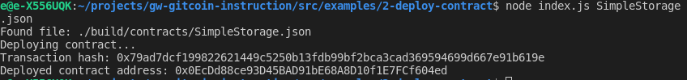

# Task 2

1.  screenshot of the console output immediately after successfully deployed a smart contract.

2. The transaction hash from the contract deployment
0x79ad7dcf199822621449c5250b13fdb99bf2bca3cad369594699d667e91b619e

3. The deployed contract address from the contract deployment 
0x0EcDd88ce93D45BAD91bE68A8D10f1E7FCf604ed