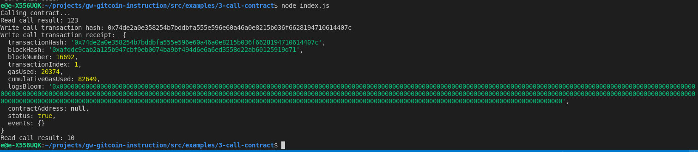

# Task 3

1. A screenshot of the console output immediately after you have successfully issued a smart contract call.




2. The transaction hash from the console output (in text format).
0x74de2a0e358254b7bddbfa555e596e60a46a0e8215b036f6628194710614407c

3. The contract address that you called (in text format).
0x0EcDd88ce93D45BAD91bE68A8D10f1E7FCf604ed

4. The ABI for contract you made a call on (in text format).
```
[
    {
      "inputs": [],
      "stateMutability": "payable",
      "type": "constructor"
    },
    {
      "inputs": [
        {
          "internalType": "uint256",
          "name": "x",
          "type": "uint256"
        }
      ],
      "name": "set",
      "outputs": [],
      "stateMutability": "payable",
      "type": "function"
    },
    {
      "inputs": [],
      "name": "get",
      "outputs": [
        {
          "internalType": "uint256",
          "name": "",
          "type": "uint256"
        }
      ],
      "stateMutability": "view",
      "type": "function"
    }
]
```