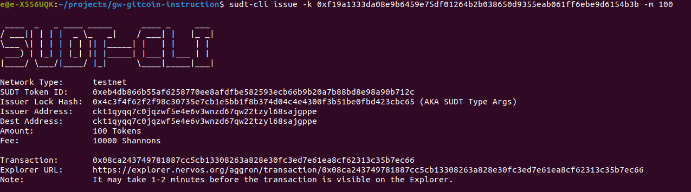
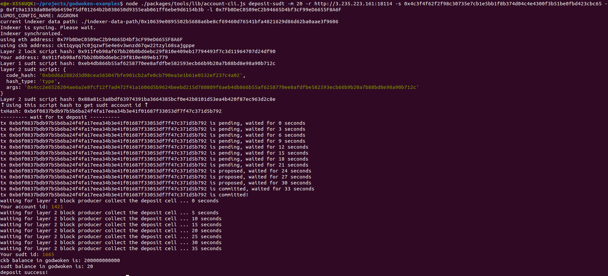

# Task 4

1. A link to the Layer 1 address you funded on the Testnet Explorer:
https://explorer.nervos.org/aggron/address/ckt1qyqq7c0jqzwf5e4e6v3wnzd67qw22tzyl68sajgppe


2. screenshot of the console output immediately after using sudt-cli to create your SUDT tokens on Layer 1.


3. A link to the transaction ID created by sudt-cli on the Testnet Explorer.
https://explorer.nervos.org/aggron/transaction/0x08ca243749781887cc5cb13308263a828e30fc3ed7e61ea8cf62313c35b7ec66


4. 3 A screenshot of the console output immediately after you have successfully submitted a deposit to Layer 2 using the account-cli tool.



5. The SUDT ID from the console output after executing the deposit script (in text format).
```
            1665
````